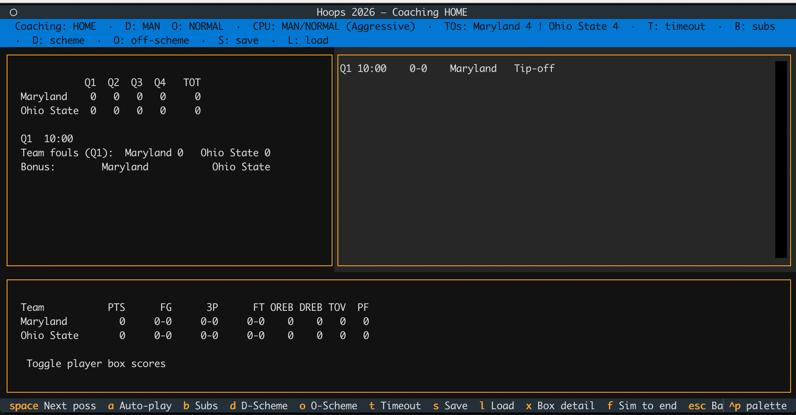

# Hoops: WBB Edition

A terminal coaching simulator for women's college basketball, covering D-I teams from 2015-16 through 2025-26. Pick any team from any season, set your defensive and offensive schemes, manage substitutions and fatigue, and coach your way through single games, NCAA tournament brackets, or conference tournaments. Inspired by the [original *Hoops* (1986) by Jeff Sagarin and Wayne Winston](https://en.wikipedia.org/wiki/Hoops_(1986_video_game)).

Built with real play-by-play data from ESPN via the sportsdataverse ecosystem.



## Requirements

- Python 3.11+
- [uv](https://docs.astral.sh/uv/) (recommended) or pip

## Install

```bash
git clone https://github.com/dwillis/hoops-game.git
cd hoops-game
uv sync
```

## Play

Launch the team picker and start a game:

```bash
uv run hoops play
```

Skip the picker and go straight to tip-off:

```bash
uv run hoops play --home "South Carolina" --away "Iowa" --season 2023-24
```

### Game Modes

**Single game** — pick two teams, coach one side (or both in head-to-head mode) against the CPU.

```bash
uv run hoops play
```

**NCAA tournament** — coach one team through the 64-team bracket. All other games are auto-simulated between rounds.

```bash
uv run hoops bracket --season 2023-24 --team "South Carolina"
```

**Conference tournament** — coach one team through their conference tourney.

```bash
uv run hoops conference --season 2024-25 --conf "Big Ten" --team "USC"
```

### Options

| Flag | Description |
|------|-------------|
| `--season` | Season for both teams (picker shown if omitted) |
| `--home` / `--away` | Skip the picker and play directly |
| `--home-season` / `--away-season` | Cross-era matchups (e.g. 2016 UConn vs 2024 South Carolina) |
| `--neutral` | Neutral site, no home court advantage |
| `--all-teams` | Include sub-D-I teams in the picker |
| `--seed` | RNG seed for reproducible games |

### In-Game Controls

| Key | Action |
|-----|--------|
| `Space` | Advance one possession |
| `F` | Fast-forward (hold) |
| `D` | Cycle defensive scheme (man / zone / press) |
| `O` | Cycle offensive scheme (balanced / hurry / three-point) |
| `U` | Toggle substitution screen |
| `X` | Toggle box score detail |
| `S` | Save game |
| `L` | Load game |

## Available Seasons

Eleven seasons of D-I women's college basketball, each with ~350 teams:

- 2015-16 through 2020-21 (20'9" three-point line)
- 2021-22 through 2025-26 (22'1.75" three-point line)

List fitted seasons:

```bash
uv run hoops seasons
```

## How It Works

The engine simulates possessions at the team level using fitted four-factor priors (pace, eFG%, turnover rate, offensive rebounding rate, free throw rate, shot zone distribution). Each possession is a series of probability draws: turnover check, shot zone selection, make/miss roll, rebound, free throws.

Lineup composition matters. Per-player rates are blended toward team priors using Bayesian shrinkage (players with more minutes get more weight on their individual stats). The on-court five affects pace, shooting efficiency, turnover rate, rebounding, and foul rate.

The CPU coach has three personality types (aggressive, conservative, balanced) derived from team stats, and reacts to game flow: switching schemes when the opponent gets hot, pressing when trailing late, slowing down with a lead.

Matchup adjustments shift team priors based on the opponent's defensive profile. Home court advantage penalizes the away team's free throw shooting, turnover rate, and efficiency.

## Project Layout

```
src/hoops/          Engine, rules, simulation, UI
data/rules/         Per-season rules (quarters, shot clock, 3pt line, bonus)
data/brackets/      NCAA tournament bracket data (JSON)
data/conf_tournaments/  Conference tournament bracket data (JSON)
scripts/            Ingestion and distribution-fitting scripts
tests/              Unit and integration tests
```

## Running Tests

```bash
uv sync --extra dev
uv run pytest
```

## Authors

**Derek Willis** ([@dwillis](https://github.com/dwillis))

Built with [Claude Code](https://claude.ai/claude-code).

## License

MIT. See [LICENSE](LICENSE).

This is a non-commercial fan project. No team logos are bundled. Player names sourced from public play-by-play feeds are used for historical-roster realism only.
